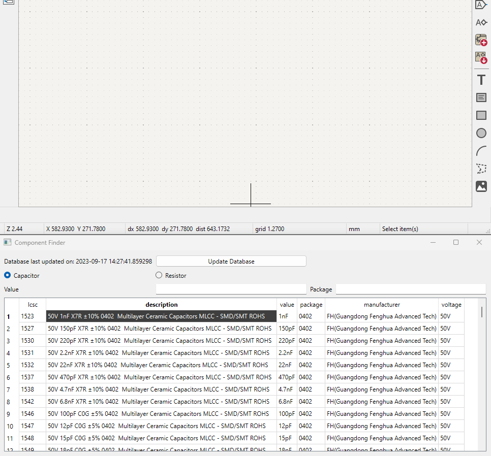

# JLCPCB Basic Resistor And Capacitor Finder

This is a simple tool to find the resistor and capacitor values that JLCPCB has in the basic library. It is based on the data from the [JLCPCB SMT Parts Library](https://jlcpcb.com/parts).

## Usage
  
- Use search to find the part you want.
- Double-click on the part to copy the value symbol to the clipboard.
- Paste the symbol into your schematic.

